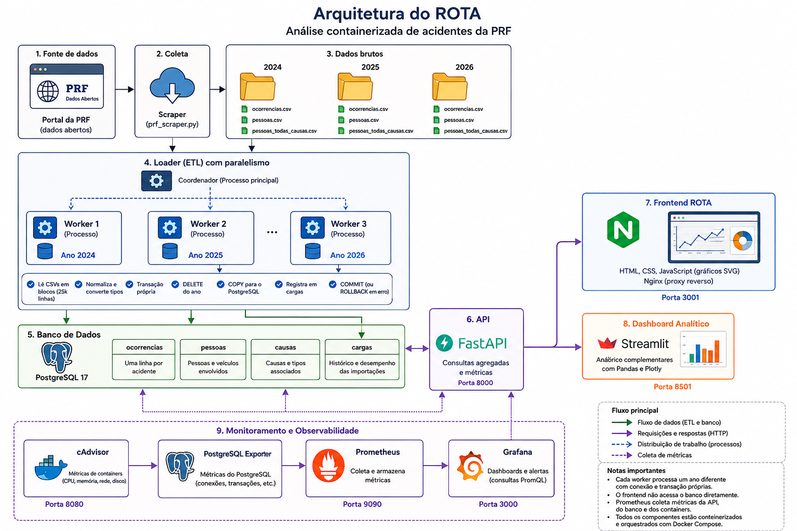

# ROTA: análise containerizada de acidentes da PRF

O **ROTA** transforma os dados abertos de acidentes da Polícia Rodoviária
Federal em uma aplicação web interativa, com armazenamento estruturado,
gráficos, API, carga paralela e monitoramento dos containers.

O projeto foi construído para responder perguntas como:

- como o número de acidentes evolui ao longo do tempo;
- quais estados concentram mais ocorrências;
- quais causas aparecem com maior frequência;
- quantas pessoas foram envolvidas, feridas ou mortas;
- quanto tempo a aplicação leva para responder;
- quanto CPU e memória os containers utilizam.

## Visão geral

<p align="center">
  
</p>

<p align="center"><em>Arquitetura completa da coleta, processamento, consulta e observabilidade.</em></p>

### Fluxo resumido

```text
Portal da PRF
     |
     v
Scraper -> arquivos CSV -> Coordenador
                              / | \
                             v  v  v
                        workers por ano
                              \ | /
                               v
                          PostgreSQL
                               |
                               v
                           FastAPI
                           /     \
                          v       v
                  Frontend ROTA  Streamlit

Prometheus <--- API + PostgreSQL exporter + cAdvisor
     |
     v
  Grafana
```

## Tecnologias

- Python 3.12
- FastAPI
- PostgreSQL 17
- Pandas
- Streamlit e Plotly
- HTML, CSS e JavaScript
- Nginx
- Prometheus
- Grafana
- cAdvisor
- Docker Compose
- multiprocessing com `ProcessPoolExecutor`

## Início rápido

### Requisitos

- Docker;
- Docker Compose;
- aproximadamente 3 GB livres para imagens, dados e volumes.

### 1. Iniciar a aplicação

```bash
docker compose up -d --build
```

### 2. Carregar os CSVs no banco

Se os arquivos já estiverem nas pastas `data/2024`, `data/2025` e
`data/2026`, execute:

```bash
docker compose --profile load run --rm loader
```

Para carregar apenas alguns anos:

```bash
docker compose run --rm loader python -m app.loader 2024 2025
```

Para distribuir os anos entre três workers:

```bash
docker compose run --rm loader python -m app.loader --workers 3 2024 2025 2026
```

### 3. Abrir a aplicação

| Recurso | Endereço |
| --- | --- |
| Página inicial ROTA | http://localhost:3001 |
| Dashboard analítico | http://localhost:8501 |
| Documentação da API | http://localhost:8000/docs |
| Grafana | http://localhost:3000 |
| Prometheus | http://localhost:9090 |
| cAdvisor | http://localhost:8080 |

Credenciais iniciais do Grafana:

```text
usuário: admin
senha: admin
```

## Como os dados chegam à tela

1. O scraper baixa os arquivos publicados pela PRF.
2. O loader lê os CSVs em blocos de 25 mil linhas.
3. O processo coordenador distribui anos diferentes entre os workers.
4. Cada worker normaliza os valores e usa sua própria transação PostgreSQL.
5. Os dados são inseridos com `COPY`.
6. A API executa consultas agregadas no banco.
7. O frontend chama a API e monta indicadores e gráficos.
8. Prometheus coleta métricas da API, do banco e dos containers.
9. Grafana transforma essas métricas em painéis de desempenho.

O frontend não lê os CSVs e não acessa o banco diretamente:

```text
Frontend -> API -> PostgreSQL
```

## Dados esperados

```text
data/
├── 2024/
│   ├── ocorrencias.csv
│   ├── pessoas.csv
│   └── pessoas_todas_causas.csv
├── 2025/
│   └── ...
└── 2026/
    └── ...
```

Os CSVs da PRF utilizam:

- separador `;`;
- codificação `ISO-8859-1`;
- `id` para identificar a ocorrência.

O banco possui quatro tabelas principais:

| Tabela | Conteúdo |
| --- | --- |
| `ocorrencias` | Uma linha por acidente |
| `pessoas` | Pessoas e veículos envolvidos |
| `causas` | Causas e tipos associados às ocorrências |
| `cargas` | Histórico e desempenho das importações |

## Paralelismo e benchmark

O loader implementa uma arquitetura mestre-trabalhador. O processo principal
descobre as pastas anuais e distribui cada ano para um processo independente.
Cada worker abre sua própria conexão com o PostgreSQL e processa apenas os
registros do ano recebido.

Executar o benchmark completo:

```bash
docker compose --profile benchmark run --rm benchmark
```

O experimento processa os mesmos 2.007.544 registros com 1, 2 e 3 workers,
usando três repetições e ordem rotativa. Os resultados ficam em
`benchmark/results/`.

Resultado medido em 11 de junho de 2026:

| Workers | Tempo médio | Linhas/s | Speedup | Eficiência |
| ---: | ---: | ---: | ---: | ---: |
| 1 | 24,135 s | 83.482 | 1,000 | 100,00% |
| 2 | 17,274 s | 116.697 | 1,397 | 69,86% |
| 3 | 12,886 s | 156.229 | 1,873 | 62,43% |

Com três workers, o tempo médio caiu aproximadamente 46,6%. A eficiência não é
linear porque os processos compartilham disco, CPU, índices e o mesmo servidor
PostgreSQL.

Relatórios:

- [relatório técnico](docs/RELATORIO_TECNICO.md);
- [guia de estudo e apresentação](docs/GUIA_APRESENTACAO.md);
- [resultado do benchmark](benchmark/results/RESULTS.md);
- [amostras brutas](benchmark/results/runs.csv);
- [resumo estatístico](benchmark/results/summary.csv).

## Testes

Executar os testes no mesmo ambiente da aplicação:

```bash
docker compose --profile load run --rm loader python -m unittest discover -v
```

Os testes cobrem normalização do ETL, descoberta dos anos, cálculo de speedup,
descoberta dos arquivos da PRF e validação de ZIP.

Para gerar entradas pequenas sem baixar os dados reais:

```bash
mkdir -p sample-data
docker compose run --rm \
  -v "$PWD/sample-data:/sample-data" \
  loader python scripts/generate_sample_data.py \
  --output /sample-data --rows 1000
```

## Baixar ou atualizar os dados

O scraper é opcional. Use-o quando precisar buscar novamente os arquivos:

```bash
docker compose --profile scrape run --rm scraper
```

Para selecionar anos diferentes:

```bash
docker compose run --rm scraper python prf_scraper.py 2023 2024 2025
```

Depois do download, execute o loader novamente.

## Operação cotidiana

Ver o estado dos containers:

```bash
docker compose ps
```

Ver os logs:

```bash
docker compose logs -f
```

Ver apenas os logs da API:

```bash
docker compose logs -f api
```

Parar a aplicação:

```bash
docker compose down
```

Parar e apagar banco e métricas persistidas:

```bash
docker compose down -v
```

> `docker compose down -v` apaga os dados carregados no PostgreSQL.

## Desenvolvimento

As instruções técnicas, a descrição dos módulos, o fluxo interno e os
procedimentos para alterar a aplicação estão em:

**[Guia de desenvolvimento](docs/DEVELOPMENT.md)**

## Observação sobre WSL2

No Docker Desktop com backend WSL2, o cAdvisor pode mostrar métricas agregadas
do host sem identificar corretamente o nome de cada container. Isso ocorre
porque o armazenamento interno do Docker Desktop não fica totalmente exposto
à distribuição Linux.

API, frontend, banco, loader, Prometheus e Grafana continuam funcionando.

## Fonte

Dados abertos da Polícia Rodoviária Federal:

https://www.gov.br/prf/pt-br/acesso-a-informacao/dados-abertos/dados-abertos-da-prf
